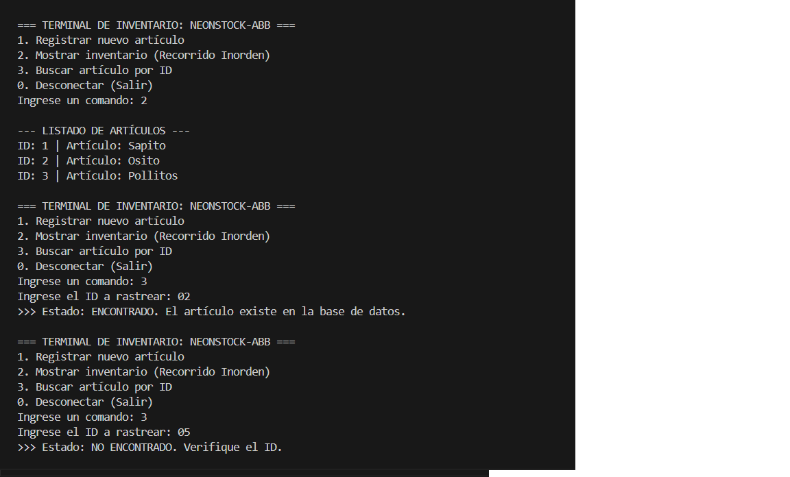
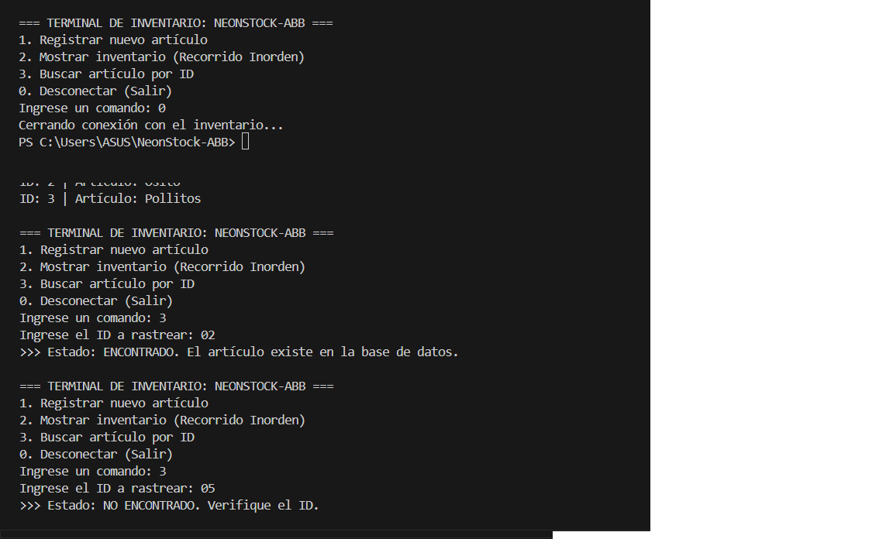

# 📦 NeonStock-Inventory (Sistema de Inventario basado en ABB)

## 🎯 Objetivo
Aplicar el concepto de Árbol Binario de Búsqueda (ABB) y su estructura lógica para gestionar un sistema de clasificación de inventario en Java, implementando nodos y punteros de forma manual sin el uso de librerías automáticas.

## 🧠 Comprensión Teórica
* **¿Qué es un Árbol Binario de Búsqueda (ABB)?**
  Es una estructura de datos dinámica no lineal donde cada elemento (Nodo) tiene como máximo dos hijos. Se organiza bajo una regla estricta: todos los valores menores al nodo raíz se ubican a su izquierda, y todos los valores mayores se ubican a su derecha. Esto permite operaciones de búsqueda increíblemente rápidas.
* **Uso de la Recursividad en nuestro inventario:**
  La recursividad se aplicó principalmente en los métodos de inserción y búsqueda. En lugar de usar bucles `while` complejos, el método se llama a sí mismo evaluando si el ID entrante es mayor o menor que el nodo actual, desplazándose por los punteros `izquierdo` o `derecho` hasta encontrar un espacio vacío (`null`) para insertar el nuevo producto, o hasta encontrar el ID deseado.

## 🚀 Instrucciones de Ejecución
1. Clonar el repositorio: `git clone [https://github.com/LuisaParra25/NeonStock-ABB]`
2. Abrir la carpeta en VS Code con el JDK de Eclipse Temurin configurado.
3. Compilar y ejecutar el archivo `Main.java`.

## 📸 Capturas de Pantalla de la Ejecución

  
 Haz clic aquí para ver todas las capturas

  
  1. **Menú e Inserción:** 
  2. **Búsqueda exitosa:** 
  3. **Listado Inorden:** 

## 🎥 Enlaces de Videos Sustentación
Maribel Román Ospina [https://drive.google.com/file/d/1DyBsGe-5KsOTNpkUkfcAb-cdnLSBibmX/view?usp=sharing]
Luisa Fernanda Parra Arboleda [https://drive.google.com/file/d/1ORppkpFWG2NLuBZtar2-wbCmKQXxsl8d/view?usp=sharing]
Jorge Alejandro Rubio Giraldo [https://drive.google.com/file/d/1FsIhT4yTNTImCzfawZZOgdJ_TAmL0eeS/view?usp=sharing]

**Desarrollado por:** 
 [Maribel Román Ospina] , [Luisa Fernanda Parra Arboleda] y [Jorge Alejandro Rubio Giraldo]